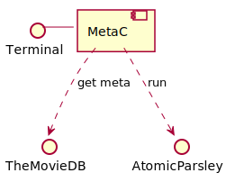

# MetaC
Automatic tagging of MP4 video directly from the command line. Front end for AtomicParsley.

# Architecture

<div hidden>
```
@startuml components
Terminal - [MetaC]
[MetaC] ..> TheMovieDB : get meta
[MetaC] ..> AtomicParsley : run
@enduml
```
</div>


# Usage
```
MetaC MyMovieFile.mp4
```
MetaC will ask TheMovieDB for available meta data, ask for your OK and tell AtomicParsley to change the file.

# Building MetaC
Clone this repo, the use 'go build' to compile. 
```
go build -ldflags "-X main.apiKey=xxxxxxxxxx" .
```
Put in your own TheMovieDB API key.

# Cross compiling
As always with go, you can easily cross-compile setting the appropriate environment settings, e.g.
```
env GOARCH=arm GOARM=7 GOOS=linux go build -ldflags "-X main.apiKey=xxxxxxxxxx" .
```
This flags in the example are the ones to build a binary for a Raspberrypi 4.
